# 🏋️‍♂️ Serverless Fitness Logger

A modern, serverless fitness tracking web application built with AWS services. Track your workouts, view progress charts, and manage your fitness journey - all running on AWS free tier!

## 🚀 Features

- **Workout Logging**: Log exercises with sets, reps, and weights
- **Progress Tracking**: Visual charts showing weight progression and workout volume
- **Workout History**: View and filter past workouts
- **Responsive Design**: Works on desktop and mobile devices
- **Serverless Architecture**: No servers to manage, scales automatically

## 🏗️ Architecture

- **Frontend**: HTML, CSS, JavaScript hosted on Amazon S3
- **Backend**: AWS Lambda functions (Python 3.12)
- **Database**: Amazon DynamoDB
- **API**: Amazon API Gateway
- **Monitoring**: Amazon CloudWatch

## 🛠️ Technologies Used

- **Frontend**: HTML5, CSS3, JavaScript (ES6+), Chart.js
- **Backend**: Python 3.12, AWS Lambda
- **Database**: Amazon DynamoDB
- **Infrastructure**: AWS (Amplify,S3, API Gateway, Lambda, DynamoDB, IAM, CloudWatch)

## 📱 Screenshots

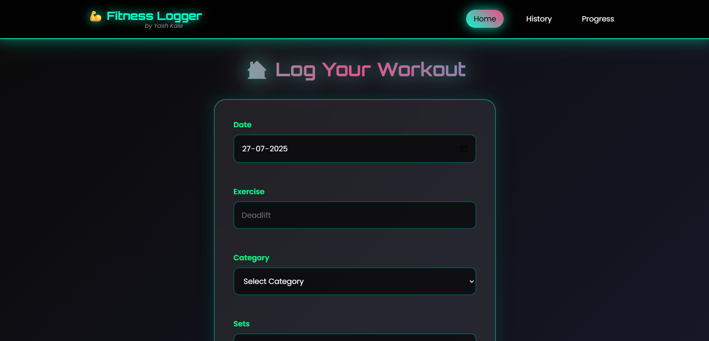
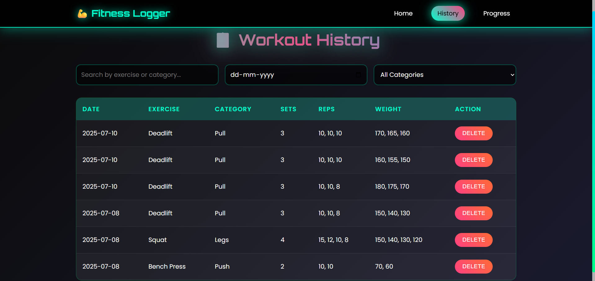

## 🚀 Deployment

See [deployment-guide.md](docs/deployment-guide.md) for detailed setup instructions.

## 📊 Architecture Diagram

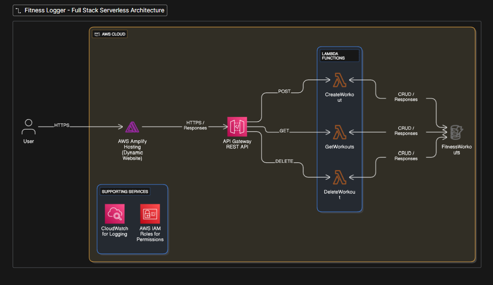

## 🖥️ AWS Console Screenshots

### DynamoDB Configuration
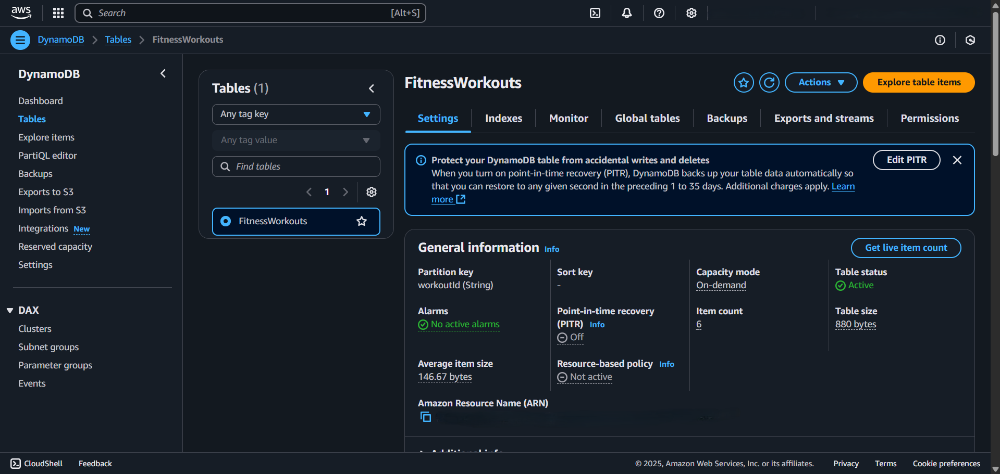
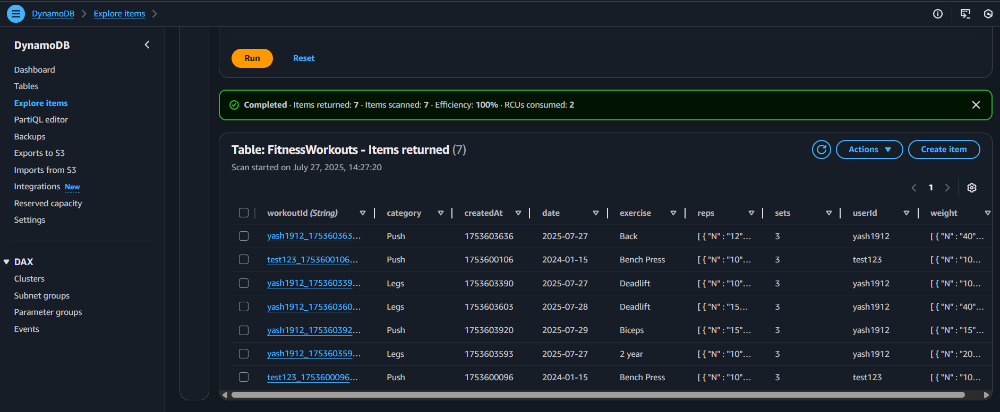

### Lambda Functions
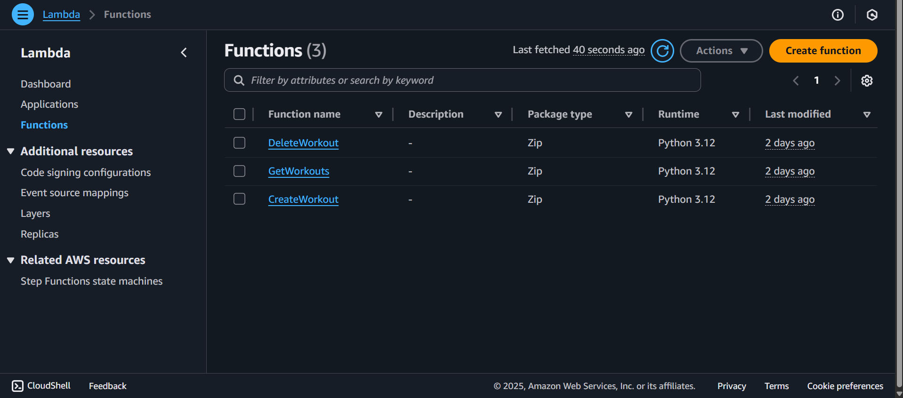
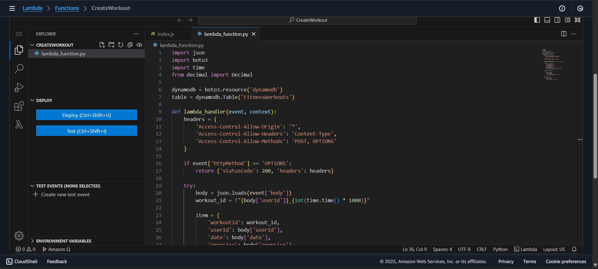

### API Gateway Setup
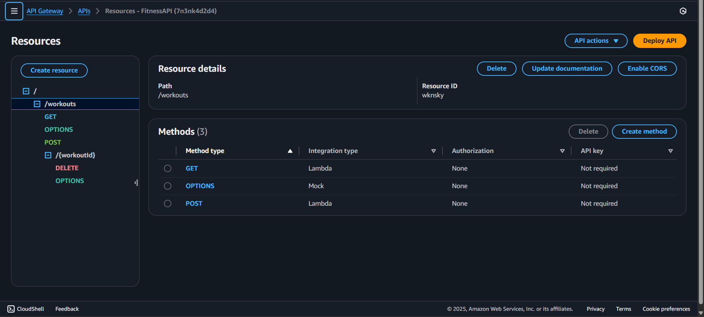
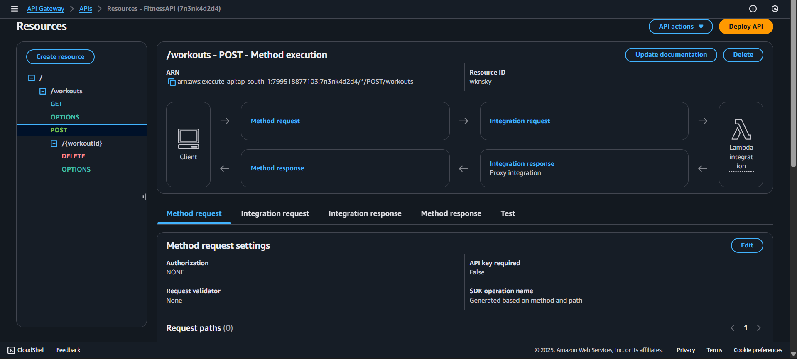

### S3 Hosting
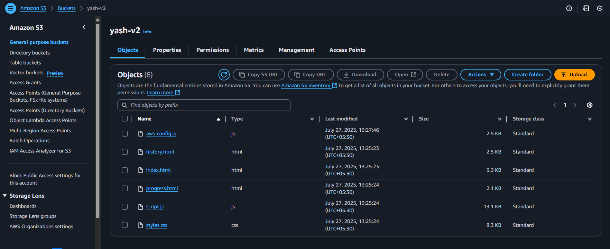
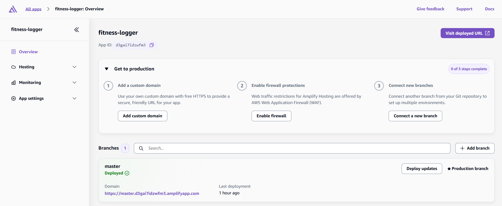

### Monitoring
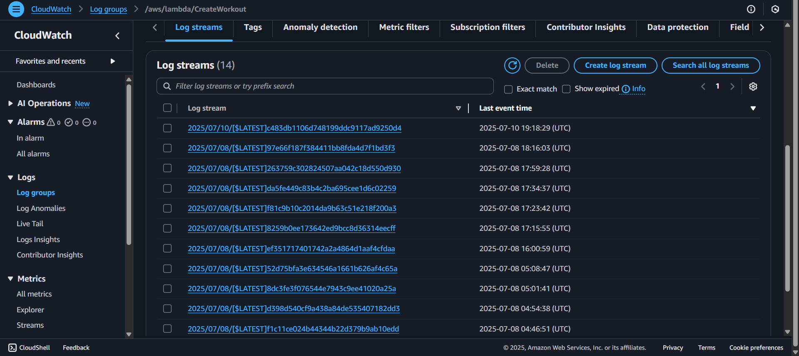

## 💰 Cost

This application runs entirely within AWS free tier limits:
- Lambda: 1M requests/month
- DynamoDB: 25GB storage
- API Gateway: 1M requests/month
- S3: 5GB storage

## 🔗 Live Demo

[Live Application](https://master.d3gai7idzwfm3.amplifyapp.com/)

## 👨‍💻 Author

**Yash kale**
- GitHub: [@yashkale402](https://github.com/yashkale402)
- LinkedIn: [Yash Kale](https://www.linkedin.com/in/yashkale001/)

## 📄 License

This project is open source and available under the [MIT License](LICENSE).
